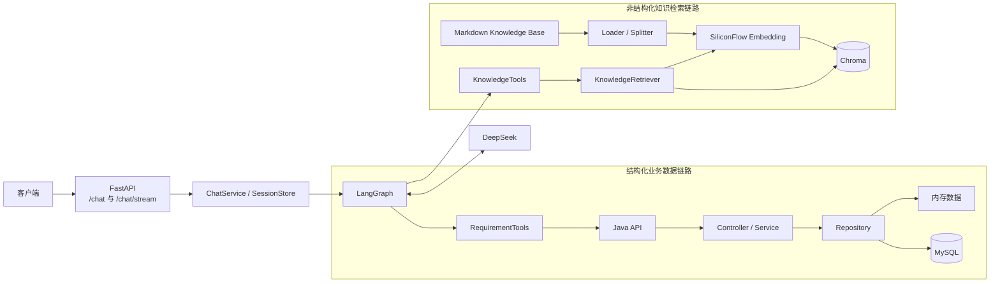
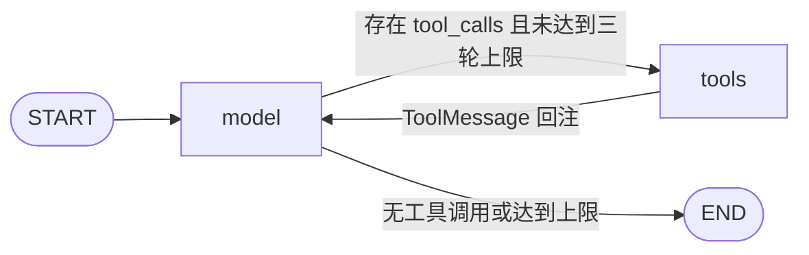
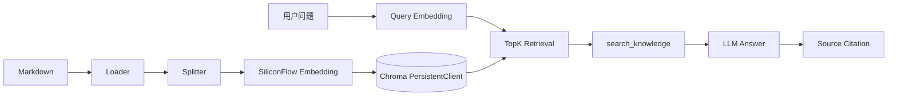

# Enterprise Support Agent

## 项目简介

这是一个面向企业需求管理场景的智能助手 Demo，采用 Java 业务服务与 Python Agent 服务分离架构。业务数据查询通过 Tool 调用 Java API，流程规则和操作说明通过 RAG 检索企业知识库，最终由 LangGraph 编排并通过普通接口或 SSE 返回结果。

## 核心能力

- Java 与 Python 双服务架构
- LangGraph Tool Calling
- 需求详情、组合检索和进度查询
- RAG 企业知识问答
- SiliconFlow Embedding 与 Chroma 持久化向量索引
- 来源引用与无足够资料时拒答
- 基于 `(user_id, session_id)` 的进程内多轮上下文
- `status`、`tool`、`message`、`error`、`done` 五类 SSE 业务事件
- 参数校验、错误映射和内部信息隔离
- Java/Python 单元测试与数据库集成测试

## 总体架构



Python Agent 不直接访问 MySQL。三个需求查询 Tool 只能通过 Java API 获取结构化业务数据；知识 Tool 只查询本地 Chroma 索引。

## LangGraph 流程



`messages` 使用 `add_messages` reducer 追加 Human、AI 和 Tool 消息，`tool_rounds` 将工具调用循环限制为最多三轮。模型通过选择不同 Tool 完成意图路由；当前没有独立 Router 节点、人工确认节点或多 Agent 子图。普通调用与流式调用共用这套图。

## RAG 流程



索引器递归加载 UTF-8 Markdown，按标题、自然段和中文句末切分，默认目标长度约 700 字符并保留约 100 字符重叠。默认 Embedding 模型为 `BAAI/bge-m3`，索引完整重建以避免重复 chunk 和已删除文档残留。查询时会校验索引模型与当前查询模型一致，`search_knowledge` 固定召回 TopK 3；最终回答列出实际使用的来源，无足够资料时明确拒答。

## 当前四个 Tool

| Tool | 用途 | 数据来源 |
| --- | --- | --- |
| `get_requirement_by_no` | 按需求编号查询详情 | Java API → Repository |
| `search_requirements` | 按编号、标题、申请人、部门、状态和创建时间等条件分页查询 | Java API → Repository |
| `get_requirement_progress` | 按需求编号查询状态、当前节点和预计完成日期 | Java API → Repository |
| `search_knowledge` | 检索需求流程规则和操作说明，固定 TopK 3 | Chroma 中的 Markdown 知识索引 |

## 调用示例

业务查询：

```text
查询 XQ202607002 的当前进度
```

知识问答：

```text
一级统筹是不是必须经过？
```

回答内容由模型基于实际召回资料生成，格式示例：

```text
一级统筹并非所有组织都必须经过，是否启用取决于组织当前配置。

参考来源：
- 《需求提报及流转相关说明》，需求提报及流转相关说明.md
```

## SSE 事件

`POST /chat/stream` 只对外发送稳定的业务事件，不直接暴露 LangGraph 原始事件。

| 事件 | 语义 |
| --- | --- |
| `status` | 请求已进入处理流程 |
| `tool` | 工具开始或完成的概括状态，不含 Tool 参数和原始结果 |
| `message` | 面向用户的最终回答文本增量，不含模型 reasoning |
| `error` | SSE 响应开始后发生的结构化错误 |
| `done` | 本轮 LangGraph 流正常完成 |

Graph State 由 SQLite Checkpointer 在节点完成时保存，SSE 不再维护或保存第二套历史；响应开始后的异常使用 `error` 事件返回，因为此时不能再修改 HTTP 状态码。向最终用户返回的知识结果不会包含向量、distance、chunk ID、本地绝对路径等内部字段。

## 技术栈

| 分类 | 技术 |
| --- | --- |
| Java 后端 | Java 25、Spring Boot、MyBatis-Plus、Flyway |
| Python Agent | Python 3.14、FastAPI、Pydantic、异步 httpx |
| Agent / LLM | LangGraph、LangChain Core、DeepSeek |
| RAG / 向量检索 | SiliconFlow Embedding、`BAAI/bge-m3`、Chroma PersistentClient |
| 数据库与工程化 | MySQL 8.4、Spring Profile、Docker Compose、uv、Maven Wrapper |
| 测试与静态检查 | JUnit 5、Mockito、Spring Test、Testcontainers、pytest、Ruff、mypy |

## 仓库结构

| 目录 | 职责 |
| --- | --- |
| `backend/` | Java 业务后端；Controller、Service、Repository 分层 |
| `agent/` | Python Agent、四个 Tool、会话与 RAG 实现 |
| `knowledge/` | 用于构建索引的 Markdown 知识文档 |
| `docs/` | API 契约、当前调用链与开发记录 |
| `docker/`、`docker-compose.yml` | 本地 MySQL 配置 |

## 快速启动

### 1. 启动 Java 后端

默认 `local` Profile 使用内存 Repository，无需 MySQL：

```powershell
cd backend
./mvnw.cmd spring-boot:run
```

如需使用 MySQL Repository，先在仓库根目录启动 MySQL，再激活 `mysql` Profile：

```powershell
docker compose up -d mysql
cd backend
$env:SPRING_PROFILES_ACTIVE="mysql"
./mvnw.cmd spring-boot:run
```

Java 健康检查：`http://localhost:8080/health`。

### 2. 配置 Python Agent

在 `agent/` 目录同步依赖，并通过环境变量提供密钥和服务地址：

```powershell
cd agent
uv sync
$env:DEEPSEEK_API_KEY="你的 DeepSeek API Key"
$env:SILICONFLOW_API_KEY="你的 SiliconFlow API Key"
$env:BACKEND_BASE_URL="http://localhost:8080"
```

常用可选配置：`DEEPSEEK_BASE_URL`、`DEEPSEEK_MODEL`、`BACKEND_TIMEOUT_SECONDS`、`SILICONFLOW_BASE_URL`、`SILICONFLOW_EMBEDDING_MODEL`、`CHROMA_PERSIST_DIRECTORY` 和 `CHROMA_COLLECTION_NAME`。缺少 `DEEPSEEK_API_KEY` 时健康检查仍可用，但聊天不可用；缺少 `SILICONFLOW_API_KEY` 时需求查询仍可用，知识 Tool 会返回未配置错误。

### 3. 构建并预览知识索引

索引不会在服务启动时自动构建。在 `agent/` 目录执行：

```bash
uv run python -m app.rag.indexer
uv run python -m app.rag.search_preview "一级统筹是不是必须经过？"
```

### 4. 启动 FastAPI

```bash
uv run uvicorn app.main:app --reload --port 8000
```

Agent 健康检查：`http://localhost:8000/health`；OpenAPI 页面：`http://localhost:8000/docs`。

### 5. 调用聊天接口

普通聊天：

```bash
curl -sS -X POST "http://localhost:8000/chat" \
  -H "Content-Type: application/json" \
  -d '{"userId":"demo-user","sessionId":"demo-session","message":"查询 XQ202607002 的当前进度"}'
```

SSE 流式聊天：

```bash
curl -N -X POST "http://localhost:8000/chat/stream" \
  -H "Content-Type: application/json" \
  -H "Accept: text/event-stream" \
  -d '{"userId":"demo-user","sessionId":"stream-session","message":"一级统筹是不是必须经过？"}'
```

Windows PowerShell 直接将中文传给 `curl.exe` 时可能受本地代码页影响，可使用 JSON Unicode 转义或显式传入 UTF-8 字节。更完整的配置和调用示例见 [Agent README](agent/README.md)。

## 测试与检查

Java 后端：

```powershell
cd backend
./mvnw.cmd clean verify
```

MySQL Profile 的 Testcontainers 集成测试需要可用的 Docker 环境。Python 环境及验证由维护者执行：

```bash
cd agent
uv lock
uv run pytest
uv run ruff check .
uv run mypy app tests
```

以上是仓库当前配置的验证命令，不代表本次文档整改已执行这些检查。

## 当前边界与后续计划

当前边界：

- 仅支持需求只读查询与需求管理知识问答，不支持业务写操作、合同或订单查询。
- 会话 State 由 SQLite LangGraph Checkpointer 按 `userId + sessionId` 生成的稳定线程标识持久化，可在单实例服务重启后恢复；SQLite 不支持多实例共享。
- 不支持用户认证与数据权限控制。
- 当前 RAG 只有 TopK 向量召回，不含召回阈值、Rerank、Hybrid Search、Query Rewrite 或自动评测。
- 暂不支持同一轮组合业务数据 Tool 与知识库 Tool。
- 不包含 Human-in-the-loop、Planner / Executor、多 Agent、MCP、长期记忆或自然语言 SQL。
- Java、Python 与 MySQL 尚未提供完整的一键容器化部署。

后续计划：

- 建立 RAG 测试集与召回评估，引入相似度阈值和 Rerank。
- 评估 Hybrid Search 与 Query Rewrite。
- 完善 FastAPI 到 Java 的 Trace 透传与耗时监控。
- 后续如需多实例部署，评估支持共享连接的生产级 Checkpointer。
- 增加认证与权限控制。

## 文档入口

- [文档索引](docs/README.md)
- [Java 后端运行与开发](backend/README.md)
- [Python Agent 运行与开发](agent/README.md)
- [需求查询 API 契约](docs/requirement-api.md)
- [当前调用链与架构边界](docs/current-flow.md)
- [开发路径与迭代记录](docs/development-history.md)
