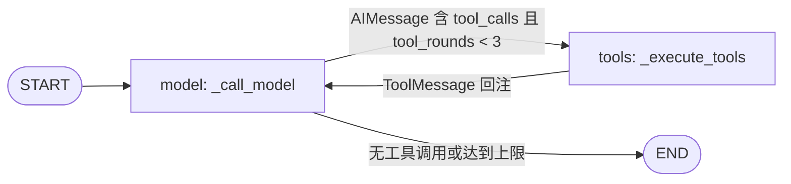
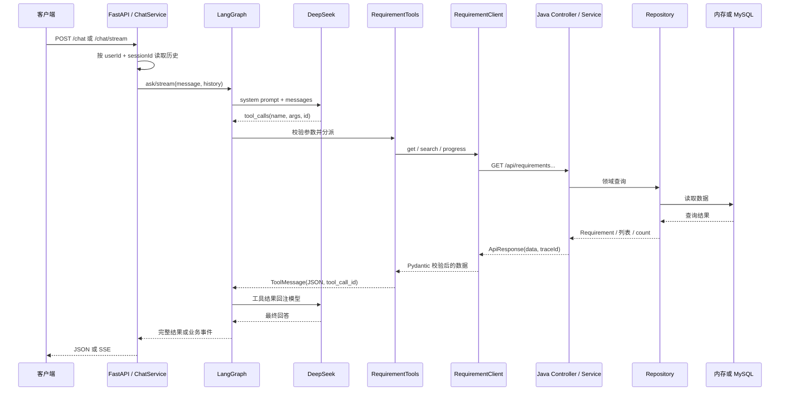
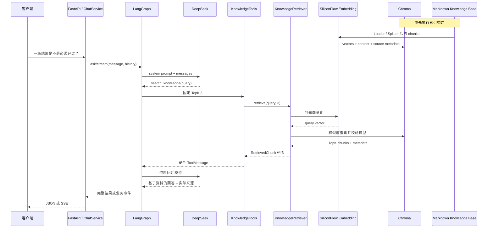

# 当前 Java 后端、Python Agent 与 RAG 调用链

本文记录当前已经实现的只读需求查询与知识问答链路，不描述后续计划中的能力。

## 模块职责

| 模块 | 职责 | 边界 |
| --- | --- | --- |
| `agent/` | 提供 `/chat` 与 `/chat/stream`，维护进程内会话，编排 LangGraph，调用 DeepSeek、Java API 和知识索引 | 不直连业务数据库；不执行写操作 |
| `backend/` | 提供需求详情、组合检索和进度查询 API，按 Controller → Service → Repository 分层 | 只读；通过 Profile 切换内存与 MySQL Repository |
| `knowledge/` | 保存用于构建索引的 UTF-8 Markdown 业务说明 | 运行时不会自动重建索引 |
| `docs/` | 保存接口契约、当前调用链和开发阶段记录 | 不承载运行时代码 |

## 统一入口与会话

1. 客户端向 `POST /chat` 或 `POST /chat/stream` 提交 `userId`、`sessionId` 和 `message`。
2. `agent/app/api/chat.py` 将校验后的 `ChatRequest` 交给 `ChatService`。普通接口返回 `ChatResponse`；流式接口只负责把业务事件编码为 SSE。
3. `ChatService` 以 `(user_id, session_id)` 为键，从 `InMemorySessionStore` 读取 `list[BaseMessage]` 历史。
4. 普通调用执行 `RequirementAgent.ask`，成功后保存完整历史。流式调用执行 `RequirementAgent.stream`，仅在收到内部 `StreamCompletedEvent` 后保存完整历史并发送 `done`。
5. 会话最多保留最近 20 条消息，仅存在当前进程内；服务重启后丢失，也不能跨实例共享。

## LangGraph 执行流程

`RequirementAgentState` 包含共享的 `messages` 和 `tool_rounds`：

- `messages` 使用 `add_messages` reducer 追加 Human、AI 和 Tool 消息。
- `tool_rounds` 每执行一次工具节点加一，将工具调用循环限制为最多三轮。

模型节点在上下文前加入系统提示词，再调用已绑定四个 JSON Schema 的 DeepSeek 模型。模型通过 Tool 选择完成意图路由；当前没有独立 Router 节点、异常解释分支、人工确认节点或多 Agent 子图。

工具节点按名称分派调用，将 `ToolExecutionResult.model_dump_json()` 与原始 tool call id 封装为 `ToolMessage`，使下一次模型调用能够关联工具请求与结果。普通 `/chat` 与流式 `/chat/stream` 共用相同的图、Tool 和提示词。

## 当前四个 Tool

| Tool | 实现 | 用途 | 数据来源 |
| --- | --- | --- | --- |
| `get_requirement_by_no` | `RequirementTools.get_requirement_by_no` | 查询需求详情 | Java API |
| `search_requirements` | `RequirementTools.search_requirements` | 组合条件分页查询 | Java API |
| `get_requirement_progress` | `RequirementTools.get_requirement_progress` | 查询需求进度 | Java API |
| `search_knowledge` | `KnowledgeTools.search_knowledge` | 查询需求规则和操作说明，固定 TopK 3 | Chroma 知识索引 |

三个 Requirement Tool 先使用 Pydantic 校验参数，再通过异步 `RequirementClient` 请求 Java。`search_knowledge` 只接收完整问题文本，不允许模型控制 TopK。模型不能直接访问 MySQL。

## 结构化需求查询调用链

1. 模型根据问题选择详情、组合检索或进度 Tool，并生成符合 JSON Schema 的参数。
2. `RequirementTools` 使用 `RequirementNoInput` 或 `SearchRequirementsInput` 校验参数。
3. `RequirementClient` 通过异步 `httpx.AsyncClient` 调用 Java：
   - `GET /api/requirements/{requirementNo}`
   - `GET /api/requirements`
   - `GET /api/requirements/{requirementNo}/progress`
4. Java `RequirementController` 校验路径或查询参数，调用 `RequirementService`。
5. `RequirementService` 依赖 `RequirementRepository` 抽象。默认 local Profile 使用 `InMemoryRequirementRepository`；mysql Profile 使用 `MyBatisRequirementRepository` → `RequirementMapper` → MySQL。
6. Java 使用统一 `ApiResponse` 返回数据、错误码和 traceId；Python Client 使用 Pydantic 校验信封与具体数据结构。
7. Tool 将安全的结构化结果写入 `ToolMessage`，模型据此生成最终中文回答。

## RAG 知识问答调用链

### 索引构建

1. `MarkdownDocumentLoader` 从 `knowledge/` 递归加载非空 UTF-8 Markdown，并保存相对来源路径。
2. `MarkdownTextSplitter` 按 Markdown 标题、自然段和中文句末切分，默认目标长度约 700 字符，重叠约 100 字符。
3. `SiliconFlowEmbeddingProvider` 使用默认模型 `BAAI/bge-m3` 批量生成 chunk 向量。
4. `KnowledgeIndexer` 通过 `ChromaVectorStore.rebuild` 删除同名 collection 并完整重建，避免重复 chunk 与已删除文档残留。
5. Chroma `PersistentClient` 持久化向量、正文、来源元数据和构建时使用的 Embedding 模型。

### 在线检索与回答

1. 模型识别流程规则或操作说明问题，选择 `search_knowledge`。
2. `KnowledgeTools` 用 Pydantic 校验 `query`，固定调用 `KnowledgeRetriever.retrieve(query, top_k=3)`。
3. `KnowledgeRetriever` 使用 SiliconFlow 将问题向量化，再调用 `ChromaVectorStore.search`。
4. VectorStore 校验 collection 存在、内容非空，并确认索引模型与当前查询模型一致，然后返回 TopK chunk。
5. Tool 只向模型返回 `rank`、`document_title`、安全文件名 `source`、`chunk_index` 和 `content`；不返回向量、distance、chunk ID 或绝对路径。
6. Tool 结果经 `ToolMessage` 回注模型。系统提示词要求回答只依据召回资料，列出实际使用的来源；无足够资料时明确拒答。

## SSE 事件与保存时机

`RequirementAgent.stream` 消费 LangGraph 的 `messages + updates` 流式模式：`messages` 仅用于提取模型最终文本，`updates` 用于生成安全的工具状态和收集完整历史。FastAPI 不直接处理 LangGraph 原始事件。

| 事件 | 来源与语义 |
| --- | --- |
| `status` | Agent 接受请求后的处理状态 |
| `tool` | 模型节点与工具节点产生的概括状态，不含参数和原始结果 |
| `message` | 模型最终回答的文本增量，不含 reasoning 或 tool-call chunk |
| `error` | SSE 已开始后发生的安全、结构化错误 |
| `done` | ChatService 已收到内部完成事件并保存完整历史 |

只有图正常完成并产生 `StreamCompletedEvent` 后，`ChatService` 才调用 `SessionStore.save`。客户端中途断开会取消异步生成器，执行异常也不会产生内部完成事件，因此残缺历史不会保存。SSE 响应开始后已无法修改 HTTP 状态码，异常统一转为 `error` 事件。

## 核心类和方法

| 位置 | 类 / 方法 | 作用 |
| --- | --- | --- |
| `agent/app/main.py` | `create_app` | 创建 FastAPI，注入 ChatService，并在 lifespan 关闭 HTTP 连接池 |
| `agent/app/api/chat.py` | `chat` / `stream_chat` | 普通响应与业务 SSE 编码 |
| `agent/app/agent/service.py` | `ChatService.chat` / `stream_chat` / `_get_agent` | 连接会话、Agent、Java Client 和 RAG 组件 |
| `agent/app/core/session_store.py` | `InMemorySessionStore.get` / `save` | 按用户和会话维护进程内消息历史 |
| `agent/app/agent/state.py` | `RequirementAgentState` | 定义 `add_messages` 共享状态与工具轮次 |
| `agent/app/agent/graph.py` | `ask` / `stream` / `_call_model` / `_route_after_model` / `_execute_tools` | LangGraph 普通与流式入口、模型节点、条件边和工具节点 |
| `agent/app/agent/tool_schemas.py` | `requirement_tool_schemas` | 定义四个只读 Tool 的 JSON Schema |
| `agent/app/tools/requirement_tools.py` | `RequirementTools` | 校验需求 Tool 参数并安全映射 Java Client 结果 |
| `agent/app/clients/requirement_client.py` | `RequirementClient._get` | 异步调用 Java 并校验统一响应 |
| `agent/app/tools/knowledge_tools.py` | `KnowledgeTools.search_knowledge` | 固定 TopK 3，映射知识检索结果与错误 |
| `agent/app/rag/retriever.py` | `KnowledgeRetriever.retrieve` | 协调查询向量化与 Chroma 检索 |
| `agent/app/rag/embedding.py` | `SiliconFlowEmbeddingProvider` | 调用 SiliconFlow Embedding API |
| `agent/app/rag/vector_store.py` | `ChromaVectorStore.rebuild` / `search` | 完整重建、持久化、模型校验与 TopK 查询 |
| `agent/app/rag/document_loader.py` | `MarkdownDocumentLoader.load` | 递归加载 Markdown 并保留来源 |
| `agent/app/rag/text_splitter.py` | `MarkdownTextSplitter.split_documents` | 按文档结构切分知识块 |
| `backend/.../RequirementController.java` | `getByRequirementNo` / `search` / `getProgress` | 三个 Java REST 入口 |
| `backend/.../RequirementService.java` | `getByRequirementNo` / `search` / `getProgress` | 查询校验及领域/API DTO 映射 |
| `backend/.../RequirementRepository.java` | `findByRequirementNo` / `findAll` / `count` | Service 唯一依赖的仓储抽象 |
| `backend/.../GlobalExceptionHandler.java` | 异常处理方法 | 统一输出带 traceId 的 `ApiResponse` |

## 异常与安全映射

| 位置 | 情况 | 当前处理 |
| --- | --- | --- |
| FastAPI / 模型 | 未设置 `DEEPSEEK_API_KEY` | `/chat` 返回 503；SSE 返回 `AGENT_UNAVAILABLE` error；`/health` 不受影响 |
| Knowledge Tool | 未设置 `SILICONFLOW_API_KEY` | 返回 `EMBEDDING_NOT_CONFIGURED`，需求 Tool 不受影响 |
| Knowledge Tool | 索引不存在或为空 | 返回 `KNOWLEDGE_INDEX_NOT_READY` |
| Knowledge Tool | 索引与查询模型不一致 | 返回 `EMBEDDING_MODEL_MISMATCH`，提示重新构建索引 |
| Embedding | 请求失败或响应非法 | 转为安全的 `EMBEDDING_REQUEST_FAILED` |
| Tool 入参 | 不符合 Pydantic 模型 | 返回 `ERROR/INVALID_ARGUMENT` 并交给模型说明 |
| HTTP Client | 连接失败、超时 | 返回 `BACKEND_UNAVAILABLE`，不暴露 URL 或连接详情 |
| HTTP Client | 非 JSON 或响应结构不匹配 | 返回 `BACKEND_PROTOCOL_ERROR` |
| Java | 需求不存在 | 404 `REQUIREMENT_NOT_FOUND`，Tool 映射为 `NO_RESULT` |
| Java | 参数非法或未预期异常 | 统一返回带 traceId 的 400 或 500 响应 |

## 当前限制

- 仅支持需求只读查询和需求管理知识问答，不支持业务写操作、合同或订单查询。
- 会话存储为进程内 `InMemorySessionStore`，重启丢失，且不跨实例共享。
- 当前没有认证与数据权限控制。
- RAG 仅做 TopK 向量召回，不包含 Rerank、相似度阈值或 Hybrid Search。
- 系统提示词暂不支持同一轮组合结构化业务数据 Tool 与知识库 Tool。
- FastAPI 请求 traceId 尚未完整透传至 Java；Java 会自行读取或生成 traceId。
- 默认 local Profile 使用内存样例数据；只有激活 mysql Profile 时才使用 MyBatis-Plus、Flyway 和 MySQL。
