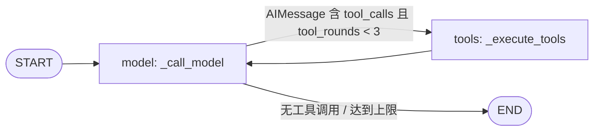
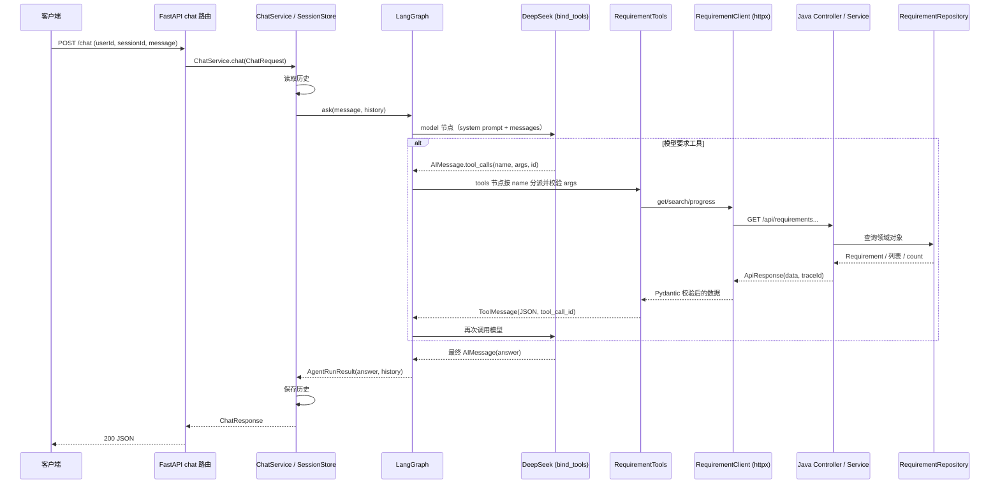

# 当前 Java 后端与 Python Agent 调用链

本文记录当前只读需求查询链路。它描述的是既有实现，不引入新接口、写操作或额外 Agent。

## 模块职责

| 模块 | 职责 | 边界 |
| --- | --- | --- |
| `agent/` | 提供 FastAPI `/chat` 与 `/chat/stream`、维护会话上下文、编排 LangGraph、调用 LLM 工具与 Java HTTP API | 不直连数据库；业务数据只来自 Java API |
| `backend/` | 提供需求详情、组合检索和进度查询 API，并按 Controller → Service → Repository 分层 | 当前只读；通过 Profile 在内存和 MySQL 实现间切换 |
| `docs/` | 接口契约、阶段计划与本调用链说明 | 不承载运行时代码 |

## 完整调用链

1. 客户端向 `POST /chat` 提交 JSON：`userId`、`sessionId`、`message`。
2. `agent/app/api/chat.py` 的 `chat(payload, request)` 将 `ChatRequest` 交给应用状态中的 `ChatService.chat`；仅将 `AgentConfigurationError` 转为 HTTP 503。
3. `agent/app/agent/service.py` 的 `ChatService.chat` 使用 `(user_id, session_id)` 从 `InMemorySessionStore.get` 读取 `list[BaseMessage]` 历史；随后调用 `RequirementAgent.ask`，并把返回 history 保存回会话。
4. `RequirementAgent.ask`（`agent/app/agent/graph.py`）将历史与新的 `HumanMessage` 组成 LangGraph 初始 `RequirementAgentState`：`messages` 使用 `add_messages` reducer 追加，`tool_rounds` 限制工具往返最多 3 次。
5. `model` 节点的 `_call_model` 在消息前插入 `REQUIREMENT_AGENT_SYSTEM_PROMPT`，调用绑定工具后的 DeepSeek 模型。模型由 `build_requirement_agent` → `create_deepseek_chat_model` 创建；`model.bind_tools(requirement_tool_schemas())` 在 `agent/app/agent/graph.py` 中注册三个 JSON Schema。
6. 条件边 `_route_after_model` 检查最后一条 `AIMessage.tool_calls`：无调用或已达 3 轮则到 `END`；否则到 `tools` 节点。模型按注册 schema 生成 `name`、`args` 与 `id`。
7. `_execute_tools` 遍历 tool calls，`_dispatch_tool` 根据名称调用 `RequirementTools` 的三个方法之一，并将 `ToolExecutionResult.model_dump_json()` 连同原 tool call id 封装为 `ToolMessage`。普通边 `tools → model` 使模型根据真实工具结果生成中文最终回答。
8. `RequirementTools`（`agent/app/tools/requirement_tools.py`）先用 Pydantic 的 `RequirementNoInput` 或 `SearchRequirementsInput` 校验模型参数，再调用 `RequirementClient`；结果统一为 `ToolExecutionResult[T]`，状态为 `SUCCESS`、`NO_RESULT` 或 `ERROR`。
9. `RequirementClient`（`agent/app/clients/requirement_client.py`）通过异步 `httpx.AsyncClient` 请求 Java：详情为 `GET /api/requirements/{requirementNo}`，组合查询为 `GET /api/requirements`，进度为 `GET /api/requirements/{requirementNo}/progress`。它用 `ApiResponse`、`Requirement`、`PageResult[Requirement]` 等 Pydantic 模型校验 camelCase 响应。
10. `backend/src/main/java/com/enabler/requirement/api/RequirementController.java` 接收请求，校验路径/查询参数并调用 `RequirementService`。`TraceIdFilter` 从 `X-Trace-Id` 读取或生成 traceId，Controller 将其写入 `ApiResponse.success`。
11. `RequirementService` 将 `RequirementQueryRequest` 映射为领域 `RequirementQuery`，调用 `RequirementRepository`，再映射为 API DTO：`RequirementDto`、`RequirementProgressDto` 或 `PageResult<RequirementDto>`。
12. `RequirementRepository` 由 Spring Profile 实现切换：非 `mysql` 使用 `InMemoryRequirementRepository`，`mysql` 使用 `MyBatisRequirementRepository` → `RequirementMapper` → MySQL `requirements` 表。结果按相同抽象返回 Service，再按反方向依次回到工具、模型、`ChatService` 与 `ChatResponse`。

## SSE 流式调用链

`POST /chat/stream` 复用相同的请求、Agent、工具和会话存储。`RequirementAgent.stream`
使用 LangGraph 的 `messages + updates` 流式模式：`messages` 中仅标准模型文本 chunk
转换为业务 `message` 事件，reasoning 与 tool-call chunk 不会向外发送；`updates`
用于生成安全的工具状态并收集最终会话历史。Agent 内部完成事件由 `ChatService` 消费，
正常完成并保存历史后才产生 `done`。FastAPI 路由只把 `status`、`tool`、`message`、
`error`、`done` 五种业务事件编码为 SSE，不理解 LangGraph 原始事件。

流开始后的异常通过结构化 `error` 事件返回，因为此时 HTTP 状态码已经不能修改。
客户端中途断开会取消异步生成器，未完成的本轮历史不会保存。普通 `/chat` 仍使用
原有一次性响应流程，接口行为不变。

## LangGraph 结构

核心状态 `RequirementAgentState` 位于 `agent/app/agent/state.py`：

- `messages: Annotated[list[AnyMessage], add_messages]`：保存 Human、AI 和 Tool 消息；各节点只返回增量，reducer 负责追加。
- `tool_rounds: int`：每执行一次 tools 节点加一；防止模型连续请求工具导致无限图循环。

## 核心类和方法

| 位置 | 类 / 方法 | 作用 |
| --- | --- | --- |
| `agent/app/main.py` | `create_app` | 创建 FastAPI，保存 ChatService，并在 lifespan 关闭 HTTP 连接池 |
| `agent/app/api/chat.py` | `chat` | `/chat` 路由和 Agent 配置错误的 503 映射 |
| `agent/app/agent/service.py` | `ChatService.chat` / `_get_agent` | 连接会话、Agent 与惰性创建的 Java Client |
| `agent/app/agent/graph.py` | `RequirementAgent.ask` / `stream` / `_call_model` / `_route_after_model` / `_execute_tools` | LangGraph 的普通与流式入口、模型节点、条件边和工具节点 |
| `agent/app/agent/tool_schemas.py` | `requirement_tool_schemas` | 定义模型可调用的三个函数及参数 JSON Schema |
| `agent/app/tools/requirement_tools.py` | `RequirementTools` | 校验工具参数、调用 Client、将异常转换为安全结果 |
| `agent/app/clients/requirement_client.py` | `RequirementClient._get` | 发出 HTTP 请求并校验 Java 统一响应信封 |
| `backend/.../RequirementController.java` | `getByRequirementNo` / `search` / `getProgress` | 三个 Java REST 入口 |
| `backend/.../RequirementService.java` | `getByRequirementNo` / `search` / `getProgress` | 业务查询、时间范围校验、领域/API DTO 映射 |
| `backend/.../RequirementRepository.java` | `findByRequirementNo` / `findAll` / `count` | Service 唯一依赖的仓储抽象 |
| `backend/.../InMemoryRequirementRepository.java` | `filtered` | local 默认实现：内存筛选、排序与分页 |
| `backend/.../MyBatisRequirementRepository.java` | `createWrapper` | mysql 实现：构造 MyBatis-Plus 条件并经 Mapper 查询 |
| `backend/.../GlobalExceptionHandler.java` | `handleBusinessException` 等 | 将异常统一为带 traceId 的 `ApiResponse` |

## Mermaid 时序图

## 正常流程

- 明确需求编号时，模型选择 `get_requirement_by_no`；询问进度时选择 `get_requirement_progress`；多条件问题选择 `search_requirements`。
- 工具参数先经 Pydantic 校验，组合查询中 Python 的 snake_case 由 `JavaApiModel` 自动转换为 Java 所需 camelCase 查询参数。
- Java 成功响应统一为 `ApiResponse<T>(success=true, code=OK, data, traceId)`；Client 先校验信封，再校验 `data` 的具体结构。
- 工具将真实数据序列化为 `ToolMessage` 回注模型；系统提示词要求模型只基于工具数据生成简洁中文答复。

## 异常流程

| 位置 | 情况 | 当前处理 |
| --- | --- | --- |
| FastAPI | 未设置 `DEEPSEEK_API_KEY` | `create_deepseek_chat_model` 抛出 `AgentConfigurationError`，路由返回 503；`/health` 不受影响 |
| 工具入参 | LLM 参数不符合 Pydantic 模型 | 返回 `ERROR/INVALID_ARGUMENT` 的 ToolExecutionResult，并交由模型说明 |
| HTTP Client | 连接失败、超时 | 转为 `BackendTransportError`；工具返回 `BACKEND_UNAVAILABLE`，不暴露 URL/连接详情 |
| HTTP Client | 非 JSON 或响应结构不匹配 | 转为 `BackendProtocolError`；工具返回 `BACKEND_PROTOCOL_ERROR` |
| Java | 需求不存在 | `RequirementNotFoundException` → `GlobalExceptionHandler` 返回 404 `REQUIREMENT_NOT_FOUND`；工具映射为 `NO_RESULT` |
| Java | 参数非法 | 全局异常处理返回 400 `INVALID_ARGUMENT` |
| Java | 未预期异常 | 全局异常处理返回 500 `INTERNAL_ERROR`，日志记录异常，响应保留 traceId |

## 当前限制

- 仅支持需求的只读查询；不支持合同、订单、写操作、认证、RAG、自然语言 SQL 或多 Agent。
- 会话存储为进程内 `InMemorySessionStore`，重启丢失，且不跨实例共享。
- LangGraph 的工具循环上限为 3；超出时直接结束，`ask` 会在无文字答案时使用兜底提示。
- Agent 不会自动把 FastAPI 请求生成的独立 traceId 传给 Java；工具接口支持 `trace_id`，但当前图分派未提供该值。Java 会自行生成 traceId。
- 默认 local Profile 是 12 条内存样例数据；仅激活 `mysql` Profile 时使用 MyBatis-Plus、Flyway 和 MySQL。
