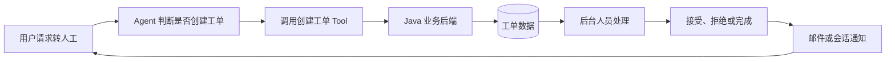

# 功能设计备忘

本文记录已经完成方案分析，但当前阶段不计划实现的功能设想。此类功能应具备明确的业务场景、职责边界和可行实现路径，以便后续根据项目目标选择性开发。

## 记录规则

- 只记录已经形成基本设计结论的功能，不记录尚未收敛的随想。
- 每个条目说明业务目标、建议流程、数据职责、当前不实现的原因和重新启动条件。
- 本文不作为当前开发计划；确定进入开发后，应在 `development-history.md` 末尾追加新阶段。
- 功能进入正式开发后，本文保留原设计结论，并补充对应开发阶段，不复制实现细节。
- 接口契约、当前调用链和实际实现状态仍分别以现有权威文档为准。

## 状态说明

| 状态 | 含义 |
| --- | --- |
| 备选 | 设计方向基本成立，但暂未确定是否实现 |
| 暂缓 | 当前不实现，等待明确业务价值或前置能力 |
| 已排期 | 已决定实现，应同步追加开发阶段 |
| 已实现 | 功能已经完成，具体实现以开发迭代记录为准 |
| 放弃 | 经过评估后不再考虑 |

## 转人工工单与 Agent 流程解耦

状态：暂缓

### 业务目标

当用户多次明确要求转人工，或当前问题无法由 Agent 有效解决时，允许 Agent 创建人工处理工单，将后续处理交给独立的后台业务流程。

### 建议流程

1. Agent 根据当前会话判断是否需要转人工。
2. Agent 调用创建工单 Tool。
3. Java 后端创建 `INIT` 或 `PENDING` 状态的工单。
4. 本轮 LangGraph 正常结束，不等待后台人员处理。
5. 后台人员通过独立管理页面接受、拒绝或完成工单。
6. 业务后端更新工单状态，并通过邮件或会话通知告知用户。
7. 用户后续可以通过查询工单 Tool 获取最新处理结果。

### 设计结论

该流程不需要暂停原 LangGraph，也不需要使用 `interrupt` 或 `Command(resume=...)` 恢复原执行过程。

原因如下：

- 工单创建完成后，Agent 本轮任务已经结束。
- 后台处理可能发生在几分钟或几小时后，不应长期占用原 Graph 执行流程。
- 工单状态属于正式业务事实，应由业务数据库管理。
- 后台人员处理工单属于独立异步业务流程，不依赖原 Graph 的节点位置。
- 后续通知可以作为新的会话事件或通过查询 Tool 获取，不需要修改既有历史消息。

因此，该功能属于 Agent 与人工业务系统的异步协作，而不是本项目计划实现的 LangGraph Human-in-the-loop 示例。

### 数据职责

| 数据 | 建议存储位置 |
| --- | --- |
| 工单编号、状态、创建人和处理结果 | Java 业务数据库 |
| 工单创建动作 | Agent Tool 调用记录 |
| 后台处理记录 | 工单操作日志或审计表 |
| 邮件发送结果 | 通知记录 |
| 用户后续收到的状态变化 | 新的会话通知或查询结果 |
| 当前会话内的转人工请求次数 | LangGraph State，可由 Checkpointer 持久化 |

### 可选实现

后续实现时，可以增加：

- 创建工单 Tool
- 查询工单 Tool
- 工单状态机
- 后台待处理列表
- 接受、拒绝和完成接口
- 邮件通知
- 会话事件通知
- 重复创建防护与幂等控制
- 工单处理超时与 SLA

### 当前不实现的原因

- 核心流程简单，现阶段不具备足够的学习增量。
- 当前项目优先补齐 LangGraph State、Checkpointer、短期记忆和 Human-in-the-loop。
- 实现后台页面、通知和工单状态机会扩大业务开发范围，但对当前 Agent 能力展示提升有限。
- 该功能设计已经明确，后续可在需要时快速交由开发工具实现。

### 重新启动条件

满足以下任一条件时，可以将该功能加入开发计划：

- 需要展示 Agent 与传统业务后台的异步协作。
- 岗位要求包含客服工单、人工接管或任务流转。
- 项目已经完成 Checkpointer 和 Human-in-the-loop，仍需要增加一个独立业务闭环。
- 需要实现实际可用的人工客服后台。